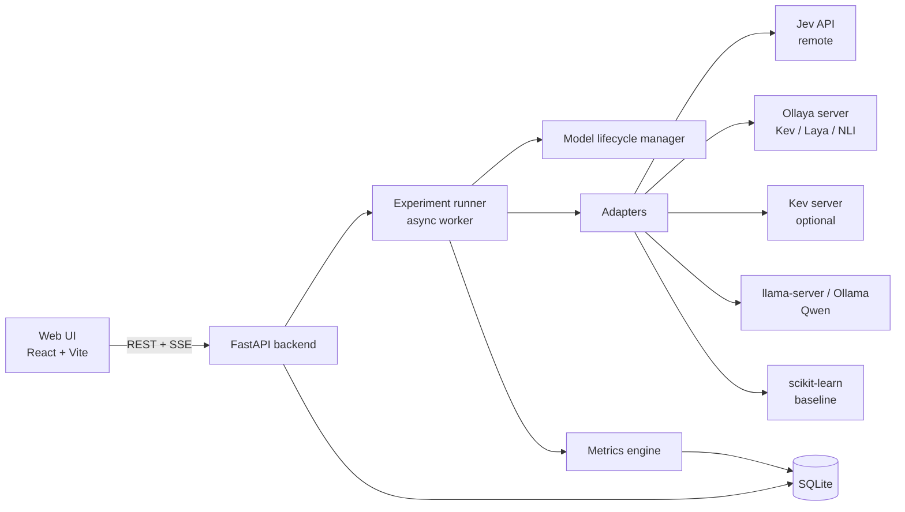

# Ticket Routing Bench — POC Specification

A local proof of concept that compares **decision models** (TypeSafe Jev, Kev, Laya and others) with a **general LLM agent** (Qwen) on support ticket routing. It runs on a Mac mini with a 16–20 GB RAM budget and has a web UI for running experiments and reading results.

This document is written to be handed to Cursor (or any coding agent) as the build brief. Items marked **VERIFY** depend on fast-moving projects (most are weeks old as of October 2026). Check them against the project's current README before implementing, and don't guess at schemas.

---

## 1. Goal and questions to answer

The POC should answer one business question:

> Which system can route the largest share of tickets automatically at a target accuracy (e.g. 95%), at acceptable latency and cost, while handling routing options that change over time?

Supporting questions:

1. How accurate is each system, overall and per queue?
2. Are the confidence scores trustworthy (calibrated) enough to automate high-confidence tickets and escalate the rest?
3. How well does each system handle a new or renamed queue without retraining?
4. How sensitive is each system to option order and option wording?
5. What are latency, memory and cost on a Mac mini?
6. Does a cascade (fast decision model first, LLM agent only for low-confidence tickets) beat any single system?

### Success criteria (fill in before running)

| Criterion | Target |
|---|---|
| Automation rate at 95% accuracy | ≥ 60% of tickets |
| Macro-F1 | ≥ 0.85 |
| p95 latency per ticket (local) | ≤ 1.5 s |
| Zero-shot accuracy on a newly added queue | ≥ 0.75 |
| Invalid output rate | 0% after one retry |
| Data leaves the machine | Acceptable only for Jev, flagged in UI |

---

## 2. Systems under test

Every system is wrapped behind the same adapter interface (section 6) so the bench treats them identically.

| ID | System | Type | Runtime | Notes |
|---|---|---|---|---|
| `jev` | TypeSafe Jev (`jev-latest`) | Decision model, hosted | HTTPS API | Closed weights. Tickets leave the machine. Access may require waitlist approval. |
| `kev-0.8b` | Kev 0.8B | Decision model, local | Ollaya (`kev`) or Kev server | Apache-2.0, Qwen3.5 base. Default local candidate. |
| `kev-4b` | Kev 4B | Decision model, local | Ollaya (`kev:4b`, quantized) | Use quantized weights to stay inside the RAM budget. |
| `kev-9b` | Kev 9B (optional) | Decision model, local | Ollaya (`kev:9b`, quantized) | Run alone; nothing else loaded. |
| `laya` | Laya English (421M) | Decision model, local | Ollaya (`laya:en`) | Small and fast; good latency baseline. |
| `qwen-logprob` | Qwen instruct, option scoring via log-probabilities | LLM, local | llama.cpp `llama-server` | Gives real per-option probabilities. |
| `qwen-json` | Qwen instruct, JSON answer with stated confidence | LLM, local | Ollama or llama-server | Tests verbalized confidence. |
| `qwen-agent` | Qwen instruct, tool-calling agent | LLM agent, local | Ollama or llama-server | Agent loop that looks up queues and submits a route. |
| `nli` | ModernBERT-large NLI zero-shot (baseline) | Classic zero-shot | Ollaya (`nli:modernbert-large`) or HF transformers | Cheap zero-shot lower bound. |
| `tfidf-lr` | TF-IDF + logistic regression (baseline) | Supervised | scikit-learn | Trained on the train split. Cannot handle new queues; that's the point of including it. |
| `cascade` | Decision model → Qwen agent for low confidence | Composite | Bench-level | Configurable threshold and pair. |

Optional extras if time allows: OpenJev, NanoJev, SemIf, GLiClass (available in Ollaya), JevK5. Add them as adapters later; the design should make this a one-file change.

**VERIFY:**
- Ollaya model tags (`kev`, `kev:4b`, `kev:9b`, `laya:en`, `nli:modernbert-large`), its HTTP API port and its request/response schema.
- Kev server command and flags on Apple silicon (the repo documents `uv run --extra serve python -m kev.serve ...`; an MLX backend for Qwen3.5 was listed as planned, not shipped).
- Jev API: endpoint `POST https://api.typesafe.ai/v1/systemone`, model `jev-latest`, body shape `{model, state, questions}`, auth header, question type names, rate limits and pricing.
- The exact Qwen instruct model tag available in GGUF (e.g. a Qwen3.5 4B or 9B instruct build). Use an **instruct** model for the agent, not a base model.
- Whether your Ollama version returns log-probabilities. If not, use `llama-server`, which supports `n_probs` on its completion endpoint.

---

## 3. Memory plan (16–20 GB budget)

Apple silicon uses unified memory, so model weights, KV cache, the backend, the browser and macOS all share the same pool. Plan for **one heavy model resident at a time**.

Approximate resident memory (weights plus overhead; measure actual numbers in the bench):

| Model | Format | Approx. RAM | Run alongside others? |
|---|---|---|---|
| Laya 421M | native | 1–2 GB | Yes |
| NLI ModernBERT-large | native | ~1.5 GB | Yes |
| Kev 0.8B | Q8 | ~1–2 GB | Yes |
| Kev 4B | Q8 | ~5–6 GB | With small models only |
| Kev 4B | bf16 | ~9–10 GB | No (avoid on this budget) |
| Kev 9B | Q8 | ~9–10 GB | No, run alone |
| Qwen instruct 4B | Q4_K_M | ~3–4 GB + KV cache | With small models only |
| Qwen instruct 9B | Q4_K_M | ~6–7 GB + KV cache | No, run alone |
| Backend + UI + browser | — | ~1.5–2.5 GB | Always |

Rules for the runner:

1. A **model lifecycle manager** loads a system before its experiment and unloads it after. Never keep two "heavy" systems (≥ 4 GB) loaded together.
2. Before loading, check free memory (`psutil.virtual_memory()`). If the estimated footprint exceeds `RAM_BUDGET_GB - current_usage`, refuse with a clear message in the UI.
3. Set `RAM_BUDGET_GB=18` in `.env` by default.
4. Limit the Qwen context window to 4096 tokens for routing (tickets are short; this keeps KV cache small).
5. Run latency experiments with nothing else heavy running, and record quantization level with every result.

---

## 4. Architecture



### Tech stack

- **Backend:** Python 3.11+, FastAPI, Pydantic v2, SQLModel on SQLite, `httpx` (async), `numpy`, `scikit-learn`, `scipy`, `psutil`. Dependency management with `uv`.
- **Runner:** in-process `asyncio` job queue (one job at a time), progress pushed over Server-Sent Events.
- **Frontend:** React + TypeScript + Vite, Tailwind CSS with custom tokens (section 11), TanStack Query, TanStack Table, Recharts (or visx for custom charts).
- **Model runtimes:** Ollaya, llama.cpp (`llama-server`) and/or Ollama, Kev repo (optional).

### Repository layout

```
ticket-routing-bench/
  README.md
  .env.example
  pyproject.toml
  configs/
    systems.yaml            # system definitions, endpoints, quantization, RAM estimates
    experiments/            # saved experiment presets (YAML)
  data/
    raw/                    # original ticket exports (gitignored)
    datasets/               # normalized JSONL datasets
    options/                # routing option sets, versioned
  backend/
    app.py                  # FastAPI entrypoint
    api/                    # routers: datasets, options, systems, runs, playground, results
    core/
      schemas.py            # Pydantic models (section 6)
      db.py                 # SQLModel tables (section 9)
      lifecycle.py          # load/unload, memory guard
      runner.py             # job queue, experiment execution
      prompts.py            # Qwen prompt templates
    adapters/
      base.py               # RoutingAdapter protocol
      jev.py
      ollaya.py             # kev, laya, nli via Ollaya
      kev_server.py         # optional direct Kev server
      qwen_logprob.py
      qwen_json.py
      qwen_agent.py
      tfidf_lr.py
      cascade.py
    experiments/            # E1–E10 implementations
    metrics/
      classification.py
      calibration.py
      selective.py
      robustness.py
      performance.py
      stats.py              # bootstrap CIs, McNemar
  frontend/
    src/
      pages/                # section 10
      components/
      charts/
      styles/tokens.css
  scripts/
    import_tickets.py
    make_splits.py
    smoke_test.py           # one ticket through every enabled system
  tests/
```

---

## 5. Data

### 5.1 Ticket dataset

Normalized JSONL, one ticket per line:

```json
{
  "id": "T-000123",
  "text": "I upgraded to Pro yesterday but still can't access the API dashboard.",
  "subject": "Pro upgrade not working",
  "channel": "email",
  "language": "en",
  "created_at": "2026-08-14T09:12:00Z",
  "gold_queue": "api_access",
  "gold_queue_secondary": null,
  "tags": ["multi_issue:false", "length:short"],
  "split": "dev"
}
```

Guidelines:

- **Size:** 300–500 labelled tickets minimum, at least 20–30 per queue. More is better for calibration metrics.
- **Splits:** `train` (only for `tfidf-lr` and any fine-tuning), `dev` (for tuning descriptions and thresholds), `test` (locked; run only for final comparison). Suggested 40 / 30 / 30, stratified by queue. The UI must warn when someone runs on `test` more than once per option-set version.
- **Hard-case tags:** tag tickets that are long threads, contain typos, are mixed-language, contain several issues, or fit no queue. Experiment E6 slices by these tags.
- **PII:** redact emails, phone numbers, card numbers and names during import (`scripts/import_tickets.py`), especially before anything is sent to the Jev API.
- **If you have no real tickets:** start from a public customer-support dataset on Hugging Face (VERIFY licence), and/or generate synthetic tickets with the local Qwen model. Synthetic data is fine for building the pipeline, but final conclusions should come from real tickets, because synthetic tickets are cleaner and easier than real ones.

### 5.2 Routing option sets (versioned)

Options are data, not code. Every run records which option-set version it used.

```json
{
  "option_set_id": "support-queues",
  "version": 3,
  "created_at": "2026-10-04T10:00:00Z",
  "note": "Split billing into billing and refunds",
  "options": [
    {"key": "billing", "label": "Billing", "description": "Payments, invoices, plan changes, failed charges", "active": true},
    {"key": "refunds", "label": "Refunds", "description": "Requests to return money for a charge or subscription", "active": true},
    {"key": "api_access", "label": "API access", "description": "API keys, dashboard access, rate limits", "active": true},
    {"key": "bugs", "label": "Bugs", "description": "Errors or broken features in the product", "active": true},
    {"key": "sales", "label": "Sales", "description": "Pricing and plan questions from prospects", "active": true},
    {"key": "other", "label": "Other / human review", "description": "Anything that does not clearly fit another queue", "active": true}
  ]
}
```

Rules:

- Keep an explicit `other` option. Count routing to `other` as correct only when the gold label is `other`.
- Keys are stable; labels and descriptions can change. Rename = new version.
- Keep the active option count ≤ 16 per question. For more queues, use two-stage routing (department, then sub-queue) — see E9.
- When an option set changes, the gold labels in the dataset may need remapping. Store remaps as `{"old_key": "new_key"}` in the version record.

---

## 6. Unified adapter interface

```python
# backend/core/schemas.py
from pydantic import BaseModel
from typing import Literal

class RouteOption(BaseModel):
    key: str
    label: str
    description: str | None = None

class RoutingRequest(BaseModel):
    ticket_id: str
    text: str
    options: list[RouteOption]          # already ordered as the experiment wants
    use_descriptions: bool = True
    seed: int | None = None

class RoutingResult(BaseModel):
    ticket_id: str
    system_id: str
    predicted_key: str | None           # None if output invalid after retries
    probabilities: dict[str, float]     # over option keys, sums to 1.0 (normalize if needed)
    confidence: float                   # probability of predicted_key
    confidence_source: Literal["native", "logprob", "verbalized", "none"]
    valid_output: bool
    retries: int
    raw_response: str                   # stored for the error explorer
    latency_ms: float                   # wall-clock for this ticket, including retries
    input_tokens: int | None = None
    output_tokens: int | None = None
    cost_usd: float | None = None
    error: str | None = None
```

```python
# backend/adapters/base.py
from typing import Protocol

class RoutingAdapter(Protocol):
    system_id: str
    is_remote: bool                     # True for Jev -> UI shows "data leaves this Mac"
    est_ram_gb: float

    async def load(self) -> None: ...   # start/warm the model; measure cold start
    async def unload(self) -> None: ...
    async def route(self, req: RoutingRequest) -> RoutingResult: ...
    async def health(self) -> dict: ...
```

Requirements for every adapter:

- **Normalize probabilities** to sum to 1 over the provided option keys. If a system returns probabilities for unknown keys, drop them and set `valid_output=False`.
- **Retry once** on invalid output, then give up and record it. Never silently map invalid output to a queue.
- **Timeouts:** 30 s per ticket, configurable.
- **Determinism:** temperature 0 for Qwen variants; pass seed where supported.

### 6.1 Decision models (Jev, Kev, Laya via Ollaya or Kev server)

Build one `choice` question per ticket:

- `state` = ticket text (plus subject if present).
- question = "Which support queue should handle this ticket?" with options = option keys, and descriptions attached as the API allows.

The System One style APIs return a probability per option. Map these straight into `probabilities`. Since Kev, Ollaya and Jev aim for the same contract, one shared request builder should serve all three, with per-system base URLs and auth. **VERIFY** the exact field names for questions, options and descriptions before writing the builder.

Jev specifics: API key in `.env` (`JEV_API_KEY`), rate limiting with a token bucket, cost tracked per call, and redacted text only.

### 6.2 `qwen-logprob`

Turns a chat model into a scorer with real probabilities.

1. Prompt lists options with single-token letter labels (A, B, C …), each with its description.
2. Ask for exactly one letter. Use a grammar (llama.cpp GBNF) restricting output to the valid letters.
3. Request the top log-probabilities for the first generated token (`n_probs` ≥ number of options).
4. Softmax over the logits/log-probs of the valid letter tokens only; map letters back to option keys.

Prompt template (store in `prompts.py`):

```
You route customer support tickets to the correct queue.

Queues:
A. Billing — Payments, invoices, plan changes, failed charges
B. Refunds — Requests to return money for a charge or subscription
...

Ticket:
"""
{ticket_text}
"""

Answer with the single letter of the best queue.
Answer:
```

Note: letter labels make this variant sensitive to option order. That is expected and measured in E3.

### 6.3 `qwen-json`

Ask for `{"queue": "<key>", "confidence": <0-1>, "reason": "<short>"}` using JSON mode or a JSON grammar. `probabilities` = stated confidence on the chosen key, remainder spread evenly over the other keys (record `confidence_source="verbalized"`). This variant shows how well verbalized confidence holds up.

### 6.4 `qwen-agent`

A small tool-calling loop (max 4 steps) that mirrors how an agent would route in production:

Tools:

- `list_queues()` → keys and labels
- `get_queue_details(key)` → description and example tickets (optional few-shot examples from the `dev` split)
- `submit_route(queue_key, confidence, reason)` → ends the loop

Record steps taken, tool calls, total tokens and wall-clock latency. Invalid outputs include: no `submit_route` call within the step limit, unknown key, malformed arguments.

### 6.5 Baselines

- `nli`: hypothesis template "This ticket is about {description}." Softmax over entailment scores.
- `tfidf-lr`: trained on `train`; probabilities from `predict_proba`. For E5 (new queue), it scores zero on the unseen queue by construction.

### 6.6 `cascade`

Config: `primary` (e.g. `kev-0.8b`), `fallback` (e.g. `qwen-agent`), `threshold` (e.g. 0.8). If primary confidence ≥ threshold, use it; otherwise call fallback. Record which path each ticket took. Because both models may not fit in memory together, the runner executes the primary over all tickets first, unloads it, then runs the fallback only on the low-confidence subset.

---

## 7. Experiments

Each experiment is a preset the UI can launch: systems × dataset split × option-set version × parameters. All results are stored per ticket so any metric can be recomputed later.

| ID | Name | What it does | Key outputs |
|---|---|---|---|
| E1 | Baseline accuracy | Every system on the dataset with the default option order and descriptions | Accuracy, macro-F1, per-queue P/R/F1, confusion matrix, top-2 accuracy |
| E2 | Calibration and automation | Uses E1 predictions; sweeps confidence thresholds | ECE, Brier, NLL, reliability diagram, risk–coverage curve, automation @ target accuracy, AURC |
| E3 | Option-order sensitivity | Each ticket run with K shuffled option orders (default K=5, fixed seeds) | Flip rate, mean probability std, accuracy range across orders |
| E4 | Description ablation | Labels only vs labels + descriptions vs rewritten descriptions | Accuracy and macro-F1 delta per condition |
| E5 | New-queue zero-shot | Leave-one-queue-out: remove queue Q from options (its tickets become `other`), then add Q back unseen by tuning | Recall/precision on Q, damage to other queues, `tfidf-lr` as reference |
| E6 | Hard cases | Slices of E1 results by hard-case tags | Per-slice accuracy, `other` handling precision/recall |
| E7 | Consistency | Same ticket run N times (default N=3) | Agreement rate, probability variance |
| E8 | Performance | Fixed 100-ticket sample, sequential then batched (concurrency 1, 4, 8) | Cold start, p50/p95/p99 latency, throughput, peak RAM, tokens/ticket |
| E9 | Option-count scaling | Synthetic option sets of 4, 8, 12, 16, plus two-stage routing for larger sets | Accuracy vs option count, latency vs option count |
| E10 | Cascade | Primary/fallback pairs across thresholds | Automation rate, accuracy, mean latency, cost, share sent to fallback |

Execution order on the Mac (to minimize load/unload): group by system, run all experiments for one system, unload, move to the next.

---

## 8. Metrics: definitions

Let N be the number of tickets, K the number of options, `p_i` the probability vector for ticket i, `ŷ_i` the predicted key, `y_i` the gold key, `c_i` the confidence of `ŷ_i`.

### 8.1 Quality

- **Accuracy:** mean of `ŷ_i == y_i`. Invalid outputs count as wrong.
- **Macro-F1:** unweighted mean of per-queue F1. Primary quality metric because queues are imbalanced.
- **Weighted-F1:** report alongside, for context.
- **Per-queue precision, recall, F1, support.**
- **Confusion matrix:** counts and row-normalized.
- **Top-2 accuracy:** gold key among the two highest probabilities.
- **`other` handling:** precision and recall for the `other` option.

### 8.2 Calibration and selective routing

- **ECE (expected calibration error):** 15 equal-width bins on `c_i`. `ECE = Σ_b (|B_b|/N) · |acc(B_b) − conf(B_b)|`. Also compute adaptive (equal-mass) ECE.
- **Brier score (multiclass):** `(1/N) Σ_i Σ_k (p_ik − 1[y_i = k])²`.
- **NLL:** `−(1/N) Σ_i log p_i,y_i` (clip at 1e-12).
- **Reliability diagram:** per bin, accuracy vs mean confidence, with bin counts.
- **Risk–coverage curve:** sort tickets by `c_i` descending; for each coverage level (share of tickets automated), plot accuracy on the automated subset.
- **Automation @ target accuracy:** largest coverage where accuracy on the automated subset ≥ target (default 0.95; UI slider 0.80–0.99). **Headline metric.** Choose the threshold on `dev`, report the result on `test`.
- **AURC:** area under the risk–coverage curve (lower is better), threshold-free summary.
- **Human review load:** share of tickets below the chosen threshold, per 1,000 tickets.

### 8.3 Robustness

- **Order flip rate (E3):** share of tickets whose top prediction differs in any of the K shuffles.
- **Probability spread (E3):** mean over tickets of the standard deviation of the gold-key probability across shuffles.
- **Description delta (E4):** macro-F1(with descriptions) − macro-F1(labels only).
- **New-queue recall/precision (E5)** and **collateral damage:** change in macro-F1 on the other queues.
- **Consistency (E7):** share of tickets with identical predictions across N runs.

### 8.4 Output reliability

- **Invalid output rate:** share of tickets with `valid_output=False` after retries.
- **Retry rate:** share needing at least one retry.
- **Agent steps (qwen-agent):** mean and max steps per ticket.

### 8.5 Performance and cost

- **Cold start:** time from `load()` to first successful response.
- **Latency p50 / p95 / p99** per ticket, measured client-side, warm model.
- **Throughput:** tickets per second at concurrency 1, 4, 8.
- **Peak RAM:** max RSS of the model runtime process(es) during the run (via `psutil`), plus system memory pressure snapshot.
- **Tokens per ticket** (Qwen variants): input and output.
- **Cost per 1,000 tickets:**
  - Jev: from API pricing (configurable per-call or per-token rate in `systems.yaml`).
  - Local: `(total compute seconds / 3600) × hourly_cost`, where `hourly_cost` is a configurable amortized hardware + electricity estimate (default e.g. $0.05/hour; state the assumption in the UI).

### 8.6 Statistics

- **95% bootstrap confidence intervals** (1,000 resamples, paired by ticket) for accuracy, macro-F1, ECE and automation @ target.
- **McNemar's test** for pairwise accuracy differences between systems on the same tickets.
- The UI shows a difference as meaningful only when the CI excludes zero.

### 8.7 Practical factors (recorded manually per system)

Data leaves machine (yes/no), licence, steps to add a queue, fine-tunable (yes/no), project maturity notes.

---

## 9. Storage schema (SQLite)

```
datasets(id, name, path, n_tickets, created_at)
tickets(id, dataset_id, text, subject, gold_queue, split, tags_json)
option_sets(id, option_set_id, version, options_json, remap_json, note, created_at)
systems(id, system_id, config_json, is_remote, est_ram_gb, quantization)
runs(id, experiment_id, system_id, dataset_id, option_set_version, split,
     params_json, status, started_at, finished_at, git_sha, env_json)
predictions(id, run_id, ticket_id, variant, predicted_key, probabilities_json,
            confidence, confidence_source, valid_output, retries, latency_ms,
            input_tokens, output_tokens, cost_usd, raw_response, error)
metrics(id, run_id, name, value, ci_low, ci_high, slice)
resource_samples(id, run_id, ts, rss_mb, system_used_mb, cpu_pct)
```

`variant` holds the shuffle index (E3), description condition (E4), repeat index (E7) or cascade path (E10). `env_json` records machine model, macOS version, RAM, runtime versions and quantization so results are reproducible.

### Backend API

```
GET    /api/systems                    list systems + health + loaded state
POST   /api/systems/{id}/load          /unload
GET    /api/datasets                   POST /api/datasets/import
GET    /api/option-sets                POST /api/option-sets (creates new version)
POST   /api/playground/route           one ticket → selected systems, returns RoutingResults
POST   /api/runs                       start experiment {experiment, systems, dataset, split, option_set_version, params}
GET    /api/runs/{id}                  status
GET    /api/runs/{id}/events           SSE progress stream
GET    /api/runs/{id}/predictions      paginated, filterable
GET    /api/results/leaderboard        query by dataset, split, option-set version
GET    /api/results/{run_id}/charts    reliability, risk–coverage, confusion, latency histogram data
GET    /api/export/{run_id}.csv        and .json
GET    /api/resources                  current memory usage and budget
```

---

## 10. UI: pages and behaviour

The UI is a working instrument for running the POC, not a marketing page. Every screen should answer one question.

### 10.1 Navigation

Left rail with these pages, in this order:

1. **Overview** — current leaderboard and the automation frontier chart.
2. **Playground** — route one ticket through several systems side by side.
3. **Experiments** — configure and launch E1–E10, watch progress.
4. **Results** — detailed metrics for a run or a comparison of runs.
5. **Errors** — browse misrouted and low-confidence tickets.
6. **Queues** — edit routing options, see version history.
7. **Data** — import tickets, manage splits and tags.
8. **Models** — load/unload systems, memory meter, health.

A persistent **memory meter** sits at the bottom of the left rail: used vs 18 GB budget, with the currently loaded systems listed.

### 10.2 Overview

- **Automation frontier chart (the signature element):** x-axis = coverage (share of tickets automated), y-axis = accuracy on automated tickets, one line per system, a horizontal target line at the chosen accuracy (slider), and a marker where each line crosses it. This one chart answers the POC's main question.
- **Leaderboard table** below it: system, macro-F1, automation @ target, ECE, p95 latency, cost / 1k tickets, invalid output rate, data leaves Mac. Sortable. Each metric cell shows the 95% CI on hover.
- Filters: dataset, split, option-set version.

### 10.3 Playground

- Large ticket text area with a few saved sample tickets.
- System checkboxes (disabled with a reason if not loaded or over memory budget).
- "Shuffle options" toggle and "Use descriptions" toggle.
- **Route ticket** button.
- Result columns, one per system: predicted queue, probability bars for all options (sorted), confidence source badge (native / logprob / verbalized), latency, tokens, and the raw response in a collapsible block. For `qwen-agent`, show the tool-call trace step by step.

### 10.4 Experiments

- Experiment picker with a one-line explanation of what each one measures.
- Form: systems, dataset, split, option-set version, experiment parameters (K shuffles, N repeats, thresholds, concurrency).
- **Estimated run plan** before starting: number of calls, estimated time, peak memory, Jev API cost. Warn if the test split has already been used for this option-set version.
- **Start run** button. Live progress per system (tickets done / total, current latency, errors), streamed via SSE. **Cancel run** stops cleanly after the current ticket.

### 10.5 Results

Tabs for a selected run (or two runs side by side):

- **Summary:** metric table with CIs.
- **Calibration:** reliability diagram with bin counts; risk–coverage curve; threshold slider showing automation rate, accuracy and human review load live.
- **Queues:** per-queue P/R/F1 table and row-normalized confusion matrix heatmap.
- **Robustness:** E3 flip rates, E4 description deltas, E5 new-queue results, E7 consistency.
- **Performance:** latency histogram, p50/p95/p99, throughput by concurrency, RAM over time.
- **Compare:** pick two systems; McNemar p-value, and a list of tickets where exactly one system was correct (links to Errors).
- **Export** CSV / JSON.

### 10.6 Errors

Table of predictions filterable by system, gold queue, predicted queue, confidence range, correct/incorrect, invalid output and hard-case tag. Clicking a row opens the ticket with every system's prediction and probabilities. Lets you mark a gold label as wrong (writes a correction log; doesn't silently edit the dataset).

### 10.7 Queues

Editable table of options (key, label, description, active). Saving creates a new version with a required note. Version history with a diff view. A **Test this version** button sends the dev split through one chosen fast system (e.g. Laya) for a quick check before a full run.

### 10.8 Data and Models

- Data: import JSONL/CSV, map columns, run PII redaction preview, create stratified splits, view queue distribution.
- Models: one row per system with status (loaded / unloaded / error), estimated and measured RAM, quantization, runtime version, **Load** / **Unload** buttons and a health check.

### 10.9 States and copy

- Sentence case everywhere. Buttons say exactly what happens: "Start run", "Route ticket", "Save version", "Unload model".
- Empty states direct the next step, e.g. "No runs yet. Import tickets on the Data page, then start E1 on the Experiments page."
- Errors say what happened and how to fix it, e.g. "Kev 4B needs about 6 GB but only 3.1 GB is free. Unload Qwen 9B or choose Kev 0.8B."
- Remote systems carry a persistent marker: "Sends ticket text to TypeSafe".

---

## 11. Visual design: white paper theme

Direction: **a lab notebook on bright white paper.** The page is clean, cool white like printer paper (not cream); content is inked in near-black; each system has its own strong, distinct ink colour used consistently in every chart, badge and table. Charts sit on a faint blue graph-paper grid, which is the one decorative device and is reserved for chart areas. Everything else stays quiet.

### 11.1 Colour tokens

Base:

| Token | Hex | Use |
|---|---|---|
| `--paper` | `#FFFFFF` | Page background |
| `--paper-shade` | `#F5F6F8` | Side rail, table header, input fill |
| `--rule` | `#D5D9E0` | Borders, dividers |
| `--grid` | `#E6ECF5` | Graph-paper grid inside chart areas only |
| `--ink` | `#1B1F24` | Primary text (contrast ≈ 16:1 on white) |
| `--ink-muted` | `#535B66` | Secondary text (≈ 7:1) |
| `--focus` | `#1F4FD8` | Focus rings, primary buttons |

System inks (all ≥ 4.5:1 on white so they work as text, lines and badges; distinguishable for common colour-vision deficiencies when paired with line styles):

| System | Hex | Line style |
|---|---|---|
| Jev | `#1F4FD8` cobalt | solid |
| Kev (all sizes; shade by size: 0.8B `#0E7A5A`, 4B `#0A5C44`, 9B `#063D2D`) | green | solid, dashed, dotted |
| Laya | `#7A3FB0` violet | solid |
| Qwen logprob | `#A35200` burnt orange | solid |
| Qwen JSON | `#A35200` burnt orange | dashed |
| Qwen agent | `#7A2E0E` brown-red | solid |
| NLI baseline | `#5B6572` slate | dotted |
| TF-IDF baseline | `#8A929C` grey | dotted |
| Cascade | `#B0125B` magenta | solid, thicker |

Status colours: correct `#0E7A3D`, wrong `#C0262D`, needs review `#9A6700`, invalid output `#5B6572` with hatch pattern. Never rely on colour alone: pair with an icon or text label.

### 11.2 Typography

- **UI and body:** IBM Plex Sans (400, 500, 600). Fallback: `system-ui, -apple-system, "Segoe UI", sans-serif`.
- **Numbers:** same family with `font-variant-numeric: tabular-nums` so metric columns align. Don't use a monospace face for labels.
- **Code, raw responses and agent traces only:** IBM Plex Mono. Fallback: `ui-monospace, Menlo, monospace`.
- Scale (rem): 0.8125 / 0.875 (table) / 1 (body) / 1.25 / 1.5625 / 1.953 (page title). Line height 1.5 for body, 1.25 for headings. Max text line length ~72ch.
- Headings in sentence case, weight 600. No all-caps labels, no small eyebrow labels above headings.

### 11.3 Layout

```
┌──────────────┬───────────────────────────────────────────────────────────┐
│ Ticket       │ Overview                                   [filters ▾]   │
│ routing bench├───────────────────────────────────────────────────────────┤
│              │ ┌───────────────────────────────────────────────────────┐ │
│ Overview     │ │ Automation frontier (graph-paper grid)                │ │
│ Playground   │ │   accuracy ↑   target line ───────── ● markers        │ │
│ Experiments  │ │                          coverage →                   │ │
│ Results      │ └───────────────────────────────────────────────────────┘ │
│ Errors       │ Target accuracy [────●──] 95%                             │
│ Queues       │ ┌───────────────────────────────────────────────────────┐ │
│ Data         │ │ Leaderboard table                                     │ │
│ Models       │ └───────────────────────────────────────────────────────┘ │
│              │                                                           │
│ Memory       │                                                           │
│ 9.2 / 18 GB  │                                                           │
│ ▓▓▓▓▓░░░░░   │                                                           │
└──────────────┴───────────────────────────────────────────────────────────┘
```

- Left-aligned content, 24 px gutters, 8 px spacing scale.
- Panels are separated by 1 px `--rule` borders and whitespace, not shadows. Border radius 6 px on inputs and buttons, 0 on chart panels and tables (they read as sheets of paper).
- Playground result columns: horizontal scroll on narrow screens, one column per system, min width 280 px.
- Responsive down to tablet width; the bench is primarily a desktop tool.

### 11.4 Interaction and accessibility

- Visible 2 px `--focus` focus ring on all interactive elements.
- Motion only in response to actions (expanding a row, opening a trace). Respect `prefers-reduced-motion`.
- Chart tooltips also available via keyboard; every chart has a "View as table" toggle.
- WCAG AA contrast for all text, including chart labels.

---

## 12. Build plan for Cursor

Build in this order. Each phase should end with something runnable.

**Phase 1 — Skeleton and data (day 1)**
- Repo layout, `uv` project, FastAPI app, SQLite tables, `.env.example`.
- Import script with PII redaction, stratified split script, option-set versioning.
- Frontend shell with left rail, tokens, Data and Queues pages.

**Phase 2 — Adapters and smoke test (days 2–3)**
- `base.py`, then adapters in this order: `tfidf-lr`, `nli`, Ollaya (`laya`, `kev-0.8b`), `qwen-logprob`, `qwen-json`, `jev`, `qwen-agent`, `kev-4b`, `cascade`.
- Lifecycle manager with memory guard.
- `scripts/smoke_test.py`: one ticket through every enabled system, prints a table.
- Models page and Playground page.

**Phase 3 — Runner and core metrics (days 4–5)**
- Job queue, SSE progress, Experiments page.
- E1, E2 and E8 with metrics from sections 8.1, 8.2, 8.4, 8.5.
- Overview page with the automation frontier and leaderboard.

**Phase 4 — Robustness and comparison (days 6–7)**
- E3–E7, E9, E10. Bootstrap CIs and McNemar.
- Results tabs, Errors page, CSV/JSON export.

**Phase 5 — Final run and write-up (day 8)**
- Freeze option-set version and thresholds on `dev`.
- Run all systems once on `test`.
- Export the leaderboard and charts; write a one-page findings summary using the success criteria table in section 1.

### Instructions for the coding agent

- Treat section 6 as the contract; don't let system-specific fields leak into the runner or metrics.
- Before implementing any adapter, read the current README of that project and confirm the request/response schema. Items marked VERIFY must not be guessed. If a project's API differs from this spec, adapt the adapter, not the shared schema.
- Write unit tests for every metric in section 8 against small hand-computed examples (e.g. a 6-ticket fixture with known ECE and Brier values).
- Store raw responses for every prediction.
- Keep all configuration in `configs/systems.yaml` and `.env`; no hard-coded URLs or keys.
- Never send unredacted ticket text to remote systems.

---

## 13. Risks and caveats

- **Project maturity:** Kev, Ollaya, Laya and the other open decision models are new; APIs and model tags may change. Pin versions and commit hashes in `systems.yaml`.
- **Mac performance:** without an MLX backend, Qwen3.5-based Kev may be slower on Apple silicon than on CUDA. Report latency honestly and note runtime versions.
- **Benchmark claims:** published comparisons (e.g. Kev vs Jev) were run on the authors' data. Only your own test split counts for this decision.
- **Jev access and cost:** it may require waitlist approval; budget API spend with the run-plan estimate before each run.
- **Data leakage:** tune descriptions and thresholds on `dev` only. Run `test` once per frozen configuration.
- **Synthetic data bias:** if you bootstrap with generated tickets, expect optimistic numbers.
- **Licences:** check each model's licence before any use beyond the POC.

---

## 14. Decision guide after the POC

| Outcome | Likely recommendation |
|---|---|
| A local decision model meets the automation target and latency | Use it in production with a human-review queue below the threshold; no data leaves your infrastructure. |
| Only Jev meets the target | Weigh accuracy gain against data-sharing and cost; consider fine-tuning Kev on your tickets and re-testing. |
| Cascade wins clearly | Deploy decision model as first pass, LLM agent for the uncertain remainder; monitor fallback share. |
| No system meets the target | Improve queue descriptions and labels first (check E4 and the Errors page), then consider fine-tuning. |
| New-queue accuracy is poor everywhere | Plan to collect examples for new queues and fine-tune with varied option lists. |
